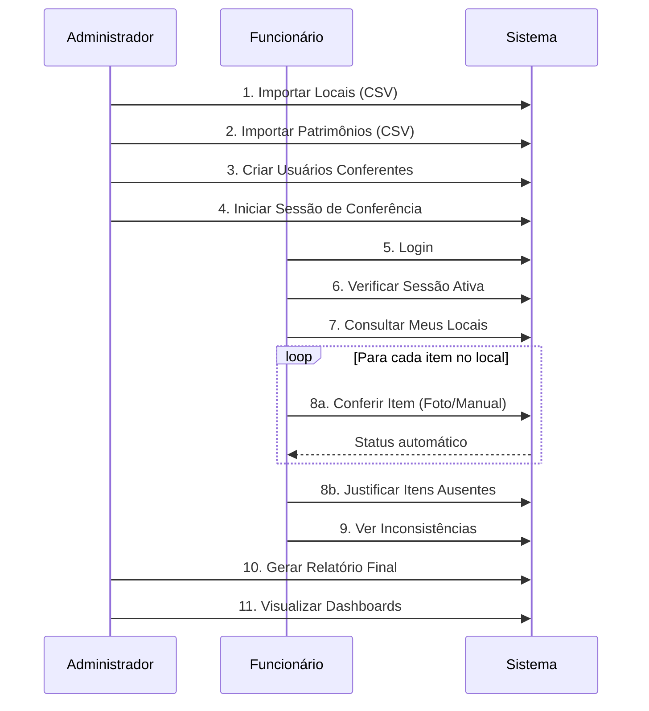

# Diagrama de Casos de Uso - Sistema de Inventário de Patrimônio

```mermaid
graph TB
    subgraph Sistema["Sistema de Inventário de Patrimônio"]
        
        subgraph Autenticacao["Autenticação e Perfil"]
            UC1[Login no Sistema]
            UC2[Visualizar Meu Perfil]
        end
        
        subgraph GestaoUsuarios["Gestão de Usuários"]
            UC3[Criar Usuário]
            UC4[Listar Usuários]
            UC5[Editar Usuário]
            UC6[Excluir Usuário]
        end
        
        subgraph GestaoLocais["Gestão de Locais"]
            UC7[Criar Local]
            UC8[Listar Todos Locais]
            UC9[Editar Local]
            UC10[Excluir Local]
            UC11[Visualizar Meus Locais]
            UC12[Visualizar Local por ID]
        end
        
        subgraph GestaoPatrimonios["Gestão de Patrimônios"]
            UC13[Criar Patrimônio]
            UC14[Listar Todos Patrimônios]
            UC15[Editar Patrimônio]
            UC16[Excluir Patrimônio]
            UC17[Visualizar Meus Patrimônios]
            UC18[Contar Patrimônios por Local]
            UC19[Visualizar Patrimônio por ID]
        end
        
        subgraph GestaoSessoes["Gestão de Sessões"]
            UC20[Iniciar Sessão de Conferência]
            UC21[Listar Sessões]
            UC22[Verificar Sessão Ativa]
        end
        
        subgraph Conferencia["Processo de Conferência"]
            UC23[Conferir Item com Foto]
            UC24[Conferir Item Manual]
            UC25[Justificar Item Ausente]
            UC26[Listar Itens Conferidos]
            UC27[Ver Inconsistências de Local]
            UC28[Ver Inconsistências do Meu Local]
            UC29[Contar Itens Conferidos]
            UC30[Visualizar Foto de Item]
        end
        
        subgraph Importacao["Importação de Dados"]
            UC31[Importar Locais via CSV]
            UC32[Importar Patrimônios via CSV]
        end
        
        subgraph Relatorios["Relatórios e Dashboard"]
            UC33[Gerar Relatório de Inconsistências]
            UC34[Visualizar Dashboard Geral]
            UC35[Visualizar Dashboard de Conferências]
            UC36[Listar Todos Itens Conferidos]
        end
    end
    
    %% Atores
    Administrador((Administrador))
    Funcionario((Funcionário/Conferente))
    Usuario((Usuário Geral))
    
    %% Relacionamentos - Autenticação
    Usuario --> UC1
    Usuario --> UC2
    
    %% Relacionamentos - Gestão de Usuários (Admin)
    Administrador --> UC3
    Administrador --> UC4
    Administrador --> UC5
    Administrador --> UC6
    
    %% Relacionamentos - Gestão de Locais
    Administrador --> UC7
    Administrador --> UC8
    Administrador --> UC9
    Administrador --> UC10
    Funcionario --> UC11
    Usuario --> UC12
    
    %% Relacionamentos - Gestão de Patrimônios
    Administrador --> UC13
    Administrador --> UC14
    Administrador --> UC15
    Administrador --> UC16
    Funcionario --> UC17
    Administrador --> UC18
    Usuario --> UC19
    
    %% Relacionamentos - Gestão de Sessões
    Administrador --> UC20
    Administrador --> UC21
    Usuario --> UC22
    
    %% Relacionamentos - Conferência
    Funcionario --> UC23
    Funcionario --> UC24
    Funcionario --> UC25
    Funcionario --> UC26
    Funcionario --> UC27
    Funcionario --> UC28
    Funcionario --> UC29
    Funcionario --> UC30
    
    %% Relacionamentos - Importação (Admin)
    Administrador --> UC31
    Administrador --> UC32
    
    %% Relacionamentos - Relatórios (Admin)
    Administrador --> UC33
    Administrador --> UC34
    Administrador --> UC35
    Administrador --> UC36
    
    %% Extensões e Inclusões
    UC23 -.include.-> UC30
    UC31 -.extend.-> UC7
    UC32 -.extend.-> UC13
    UC23 -.validation.-> UC14
    UC24 -.validation.-> UC14
    
    style Administrador fill:#e74c3c,stroke:#c0392b,stroke-width:3px,color:#fff
    style Funcionario fill:#3498db,stroke:#2980b9,stroke-width:3px,color:#fff
    style Usuario fill:#95a5a6,stroke:#7f8c8d,stroke-width:3px,color:#fff
```

---

## Descrição dos Atores

### 👤 **Usuário Geral**
Qualquer pessoa autenticada no sistema com permissões básicas.
- Pode fazer login
- Visualizar seu próprio perfil
- Consultar informações básicas

### 👨‍💼 **Funcionário/Conferente**
Usuário responsável por realizar conferências de patrimônio em locais específicos.
- Todas as permissões de Usuário Geral
- Realizar conferências (câmera ou manual)
- Visualizar seus locais responsáveis
- Visualizar seus patrimônios
- Justificar itens ausentes
- Visualizar inconsistências

### 👨‍💻 **Administrador**
Usuário com controle total do sistema.
- Todas as permissões de Funcionário
- Gerenciar usuários, locais e patrimônios
- Iniciar e gerenciar sessões de conferência
- Importar dados via CSV
- Gerar relatórios e visualizar dashboards

---

## Casos de Uso Detalhados

### 🔐 Autenticação e Perfil

| Caso de Uso | Descrição | Ator |
|-------------|-----------|------|
| **UC1** - Login no Sistema | Autenticar usando nome de usuário e senha, receber token JWT | Todos |
| **UC2** - Visualizar Meu Perfil | Ver informações do próprio perfil (nome, perfil, etc.) | Todos |

---

### 👥 Gestão de Usuários

| Caso de Uso | Descrição | Ator |
|-------------|-----------|------|
| **UC3** - Criar Usuário | Cadastrar novo usuário com nome, senha e perfil | Administrador |
| **UC4** - Listar Usuários | Visualizar lista de todos os usuários cadastrados | Administrador |
| **UC5** - Editar Usuário | Atualizar dados de um usuário existente | Administrador |
| **UC6** - Excluir Usuário | Remover usuário do sistema | Administrador |

---

### 📍 Gestão de Locais

| Caso de Uso | Descrição | Ator |
|-------------|-----------|------|
| **UC7** - Criar Local | Cadastrar novo local com código, nome e responsável | Administrador |
| **UC8** - Listar Todos Locais | Visualizar todos os locais cadastrados | Administrador |
| **UC9** - Editar Local | Atualizar informações de um local | Administrador |
| **UC10** - Excluir Local | Remover local do sistema | Administrador |
| **UC11** - Visualizar Meus Locais | Ver apenas os locais pelos quais sou responsável | Funcionário |
| **UC12** - Visualizar Local por ID | Consultar detalhes de um local específico | Todos |

---

### 🏷️ Gestão de Patrimônios

| Caso de Uso | Descrição | Ator |
|-------------|-----------|------|
| **UC13** - Criar Patrimônio | Cadastrar novo patrimônio com NI, descrição e local | Administrador |
| **UC14** - Listar Todos Patrimônios | Visualizar todos os patrimônios cadastrados | Administrador |
| **UC15** - Editar Patrimônio | Atualizar dados de um patrimônio | Administrador |
| **UC16** - Excluir Patrimônio | Remover patrimônio do sistema | Administrador |
| **UC17** - Visualizar Meus Patrimônios | Ver patrimônios dos locais sob minha responsabilidade | Funcionário |
| **UC18** - Contar Patrimônios por Local | Obter quantidade de patrimônios em um local específico | Administrador |
| **UC19** - Visualizar Patrimônio por ID | Consultar detalhes de um patrimônio específico | Todos |

---

### 🎯 Gestão de Sessões

| Caso de Uso | Descrição | Ator |
|-------------|-----------|------|
| **UC20** - Iniciar Sessão de Conferência | Criar nova sessão de inventário com data de início | Administrador |
| **UC21** - Listar Sessões | Visualizar histórico de todas as sessões | Administrador |
| **UC22** - Verificar Sessão Ativa | Consultar se existe sessão de conferência em andamento | Todos |

---

### ✅ Processo de Conferência

| Caso de Uso | Descrição | Ator |
|-------------|-----------|------|
| **UC23** - Conferir Item com Foto | Registrar conferência de item capturando foto do bem | Funcionário |
| **UC24** - Conferir Item Manual | Registrar conferência digitando manualmente o NI do item | Funcionário |
| **UC25** - Justificar Item Ausente | Registrar justificativa para item não encontrado | Funcionário |
| **UC26** - Listar Itens Conferidos | Visualizar itens já conferidos em sessão/local específico | Funcionário |
| **UC27** - Ver Inconsistências de Local | Listar itens encontrados em local diferente do esperado | Funcionário |
| **UC28** - Ver Inconsistências do Meu Local | Ver itens do meu local encontrados em outros lugares | Funcionário |
| **UC29** - Contar Itens Conferidos | Obter quantidade de itens conferidos por local/sessão | Funcionário |
| **UC30** - Visualizar Foto de Item | Acessar foto anexada a um item conferido | Funcionário |

**Lógica de Status Automático:**
- **encontrado**: Item encontrado no local esperado
- **inconsistencia_local**: Item encontrado em local diferente
- **item_nao_cadastrado**: NI não existe no cadastro de patrimônios
- **justificado**: Item ausente com justificativa registrada

---

### 📥 Importação de Dados

| Caso de Uso | Descrição | Ator |
|-------------|-----------|------|
| **UC31** - Importar Locais via CSV | Fazer upload de arquivo CSV com dados de locais (código, nome, responsável) | Administrador |
| **UC32** - Importar Patrimônios via CSV | Fazer upload de arquivo CSV com patrimônios (NI, descrição, local) | Administrador |

**Formato CSV esperado:**
- Delimitador: `;` (ponto e vírgula)
- Encoding: UTF-8
- Com cabeçalho

---

### 📊 Relatórios e Dashboard

| Caso de Uso | Descrição | Ator |
|-------------|-----------|------|
| **UC33** - Gerar Relatório de Inconsistências | Relatório completo de uma sessão: itens não encontrados, inconsistências de local, itens fora do patrimônio | Administrador |
| **UC34** - Visualizar Dashboard Geral | Resumo executivo: totais de patrimônios, locais, responsáveis, conferências e inconsistências | Administrador |
| **UC35** - Visualizar Dashboard de Conferências | Visão detalhada por local: itens esperados, conferidos, inconsistências, justificados | Administrador |
| **UC36** - Listar Todos Itens Conferidos | Listar todos os registros de conferência com filtros (sessão, local, status) | Administrador |

---

## Fluxos Principais

### 🔄 Fluxo de Trabalho Típico

---

## Regras de Negócio

### 🎯 Validações Automáticas
1. **Verificação de Existência**: Sistema verifica se o NI existe no cadastro
2. **Validação de Local**: Compara local encontrado com local esperado
3. **Detecção de Duplicatas**: Impede conferência duplicada do mesmo item
4. **Gestão de Sessão**: Apenas uma sessão ativa por vez

### 🔒 Controle de Acesso
- **Endpoints Públicos**: Login
- **Endpoints sem Autenticação**: Visualização de fotos (configurável)
- **Apenas Administrador**: Importação, relatórios, gestão completa
- **Funcionário**: Conferência e consulta de seus locais
- **JWT Token**: Expira em 1 hora

### 📸 Gestão de Fotos
- Fotos armazenadas localmente em `/uploads`
- Nome único gerado (GUID + extensão)
- Formatos aceitos: JPG, PNG, GIF, BMP
- Acessíveis via:
  - URL estática: `/uploads/{filename}`
  - Endpoint API: `/api/itensconferidos/foto/{filename}`

---

## Tecnologias e Padrões

- **Arquitetura**: API RESTful
- **Autenticação**: JWT Bearer Token
- **Banco de Dados**: MySQL com Entity Framework Core
- **Upload de Arquivos**: Multipart/form-data
- **Importação**: CsvHelper com delimitador `;`
- **Segurança**: BCrypt para senhas, CORS habilitado
