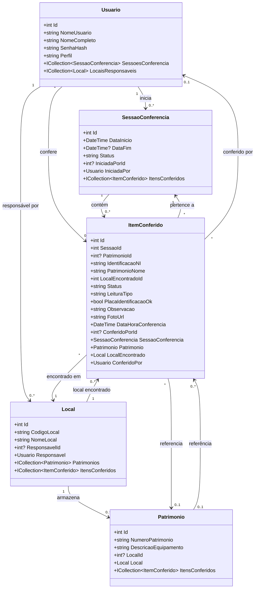

# Diagrama de Classes UML - Sistema de Inventário de Patrimônio

## Descrição das Classes

### **Usuario**
Representa os usuários do sistema que podem realizar conferências e serem responsáveis por locais.
- **Perfis**: Administrador, Conferente, etc.
- **Relacionamentos**:
  - Inicia sessões de conferência
  - Responsável por locais
  - Confere itens

### **SessaoConferencia**
Representa uma sessão de inventário com início, fim e status.
- **Status**: ativa, finalizada
- **Relacionamentos**:
  - Iniciada por um usuário
  - Contém vários itens conferidos

### **Local**
Representa os locais físicos onde os patrimônios estão ou deveriam estar.
- **Atributos**: Código único, nome descritivo
- **Relacionamentos**:
  - Possui um responsável (usuário)
  - Armazena patrimônios
  - Local onde itens são encontrados

### **Patrimonio**
Representa os bens patrimoniais cadastrados no sistema.
- **Atributos**: Número único, descrição
- **Relacionamentos**:
  - Está associado a um local esperado
  - Pode ser referenciado em conferências

### **ItemConferido**
Registro de cada item conferido durante o inventário.
- **Status**: 
  - `encontrado`: Item encontrado no local correto
  - `inconsistencia_local`: Item encontrado em local diferente
  - `item_nao_cadastrado`: Item não existe no cadastro
  - `justificado`: Item faltante justificado
- **LeituraTipo**: camera, manual
- **Atributos especiais**:
  - `FotoUrl`: Caminho da foto do item
  - `IdentificacaoNI`: Número de identificação lido (NI = Número Identificação)
  - `PlacaIdentificacaoOk`: Estado da placa de identificação
- **Relacionamentos**:
  - Pertence a uma sessão
  - Pode referenciar um patrimônio (null se não cadastrado)
  - Encontrado em um local
  - Conferido por um usuário

## Cardinalidades

| Relacionamento | Descrição |
|----------------|-----------|
| Usuario 1 → N SessaoConferencia | Um usuário pode iniciar várias sessões |
| Usuario 1 → N Local | Um usuário pode ser responsável por vários locais |
| Usuario 1 → N ItemConferido | Um usuário pode conferir vários itens |
| SessaoConferencia 1 → N ItemConferido | Uma sessão contém vários itens conferidos |
| Local 1 → N Patrimonio | Um local pode ter vários patrimônios |
| Local 1 → N ItemConferido | Itens podem ser encontrados em um local |
| Patrimonio 0..1 → N ItemConferido | Um patrimônio pode estar em várias conferências (opcional) |

## Padrões de Uso

### Fluxo de Conferência
1. **Usuário** inicia uma **SessaoConferencia**
2. Durante a conferência, cada item escaneado/digitado cria um **ItemConferido**
3. O sistema verifica se o **Patrimonio** existe e se está no **Local** correto
4. Foto é anexada ao **ItemConferido** (se disponível)
5. Status é definido automaticamente com base nas verificações

### Detecção de Inconsistências
- **ItemConferido** compara `LocalEncontradoId` com `Patrimonio.LocalId`
- Se diferentes: `status = "inconsistencia_local"`
- Se patrimônio não existe: `status = "item_nao_cadastrado"`
- Se tudo OK: `status = "encontrado"`
